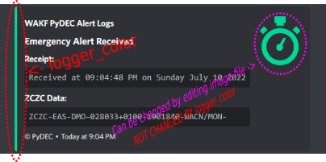
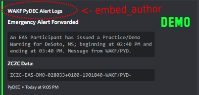
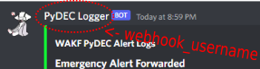

# PyDEC

\
\
PyDEC is a software EAS Endec written in Python
\
This is a **very** early version and has very little features
\
**But wait!** More features are to come!

# Installation
This guide is for mainly for installing on windows (since it is being developed on it) but PyDEC *should* work on Linux

 

## pip Install Command

`py -m pip install colorama wave sounddevice soundfile pydub scipy numpy EASGen EAS2Text discord_webhook`

This command *should* install all the libraries that are needed, but this list may not be sufficient for your installation.

 

## Config File

Open `config.json` with a texteditor

Set the `callsign` value to your stations callsign.

**NOTE:** The callsign has to be **8 characters** long and not include a `-`(dash)

 

The `logger_color` setting is the color used in the embed for the received alert embed. (This is set by using a HEX color code. Just remove the #)

  

`timezone_offset` is used to convert the UTC time of an alert to your timezone. For example, `-4` would be for EDT (This is used in the logger)

 

`embed_author` is the text at the top of the embed.
\
`embed_author_link` makes that text send you to a website when clicked.

 

`webhook_username` sets the username of the webhook. Pretty simple :P

 

`logger_webhook` is where you put the link(s) for your webhook(s). If your using multiple webhook links you'll need to use a json array/list.

 

Now save the config file and close it

 

## Starting PyDEC

You do have to start the scrips in a certain order so there isn’t a chance of everything burning down

Run the `StartAudio.bat` file first.

It will ask what audio output you want to use.

Simply select the output by inputting the number on the list and hitting enter

Now run `StartPyDEC.bat`

This window will look like it's doing nothing but no logging/prints have been added to this file, *yet*...

Next, you'll need to look at your default audio input.

The monitor script **only** uses it, so make sure it is set to the correct one you want to use

Then run `StartMon1.bat` 

This script is now waiting for alerts and will send then so the main script, which then sends it to the playback script

## **Congrats, PyDEC is now running!**

 

## Release Notes
- Added discord logging
- Added a duplicate alert check

If you have any isses or request(s) just send me a discord DM or add something under the "issues" tab 

^w^

