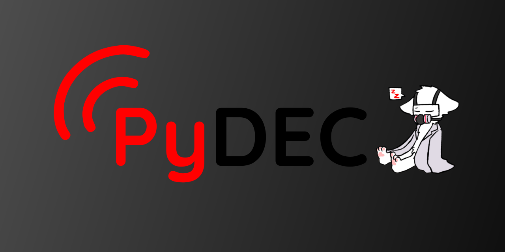

# PyDEC

\
\
PyDEC is a software EAS Endec written in Python
\
This is a **very** early version and has very little features
\
**But wait!** More features are to come!

# Installation
This guide is for mainly for installing on windows (since it is being developed on it) but PyDEC *should* work on Linux

## pip Install Command

`py -m pip install colorama wave sounddevice soundfile pydub scipy numpy EASGen`

This command *should* install all the libraries that are needed, but this list may not be sufficient for your installation.

## Config File

Open `config.json` with a texteditor and you'll see only one parameter to change.

Set the `callsign` value to your staions callsign.

**NOTE:** The callsign has to be **8 characters** long and not include a `-` (dash)

Save the file and then close it

## Stating PyDEC

You do have to start the scrips in a certain order so there isn’t a chance of everything burning down

Run the `StartAudio.bat` file first.

It will ask what audio output you want to use.

Simply select the output by inputting the number on the list and hitting enter\

Now run `StartPyDEC.bat`

This window will look like it's doing nothing but no logging/prints have been added to this file, *yet*...

Next, you'll need to look at your default audio input.

The monitor script **only** uses it, so make sure it is set to the correct one you want to use

Then run `StartMon1.bat` 

This script is now waiting for alerts and will send then so the main script, which then sends it to the playback script

## **Congrats, PyDEC is now running!**
